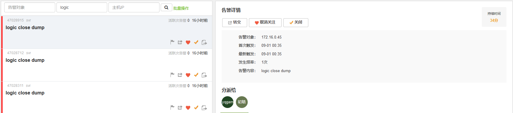

# 游戏服务器崩溃分析报告\(20180901\)

## 事情经过

早上8点多钟，收到客服群反馈部分区服进不去，经测试的确是进不去，初步怀疑服务器core了，查看OneAlert的确有3条服务器奔溃的告警，时间都在0点，但因为免费告警数量超上限，未能及时收到



## 事故分析

奔溃后，第一反应就是去查看core文件

```cpp
Program terminated with signal 11, Segmentation fault.
#0  CRkLogicBillServerConnnection::IsConnecting (this=0x3931393038636632)
    at rk_logic_bill_server_connection.cpp:47
47              return (m_iSocketFd > 0);
(gdb) l 40
35      bool CRkLogicBillServerConnnection::Initialize(const std::string& strBillIP, int16_t nBillPort, const std::string& strLocalIP, int16_t nLocalPort)
36      {
37              m_strBillIP = strBillIP;
38              m_nBillPort = nBillPort;
39              m_strLocalIP = strLocalIP;
40              m_nLocalPort = nLocalPort;
41
42              return (true);
43      }
44
45      bool CRkLogicBillServerConnnection::IsConnecting() const
46      {
47              return (m_iSocketFd > 0);
48      }
49
50      int32_t CRkLogicBillServerConnnection::GetFd() const
51      {
52              return (m_iSocketFd);
53      }
```

程序奔溃在47行，一个不可能出错的地方，初步怀疑this指针出问题了，果然出问题了

```cpp
CRkLogicBillServerConnnection::IsConnecting (this=0x3931393038636632)
```

this值为巨大一个数值，怀疑在程序的某处数组越界导致重写了this指针的值，查看调用堆栈

```cpp
(gdb) bt
#0  CRkLogicBillServerConnnection::IsConnecting (this=0x3931393038636632)
    at rk_logic_bill_server_connection.cpp:47
#1  0x000000000113f5f6 in CRkLogicBillServerConnnection::SendData (this=0x3931393038636632, 
    data=0x237e430 <CRkLogicBillServerConnnection::SendMsgToBill(int, int, enmRkLogicBillCmd, CBillMessageBody*)::szPackage> "", 
    size=901) at rk_logic_bill_server_connection.cpp:214
#2  0x000000000113f55d in CRkLogicBillServerConnnection::SendMsgToBill (this=0x3931393038636632, iUIN=280842, iGroupID=99, 
    enmCmd=EXEC_STAT_SQL, pszMsgBody=0x7fff7d85ebb0)
    at rk_logic_bill_server_connection.cpp:140
#3  0x0000000001146d63 in CRkLogicBillServerConnnection::SendStatSqlToBill<char const (&) [810], char const*, char const*, int&, short&, int const&, int&, char const*, int&, int&, int&, int&, int&, int&, int&, int&, char const*>(int, int, char const (&) [810], char const*&&, char const*&&, int&, short&, int const&, int&, char const*&&, int&, int&, int&, int&, int&, int&, int&, int&, char const*&&) (
    this=0x3931393038636632, iUIN=280842, iGroupID=99, 
    args=<unknown type in logic_svr, CU 0x88621b, DIE 0x917528>, 
    args=<unknown type in logic_svr, CU 0x88621b, DIE 0x917528>, 
    args=<unknown type in logic_svr, CU 0x88621b, DIE 0x917528>, 
    args=<unknown type in logic_svr, CU 0x88621b, DIE 0x917528>, 
    args=<unknown type in logic_svr, CU 0x88621b, DIE 0x917528>, 
    args=<unknown type in logic_svr, CU 0x88621b, DIE 0x917528>, 
    args=<unknown type in logic_svr, CU 0x88621b, DIE 0x917528>, 
    args=<unknown type in logic_svr, CU 0x88621b, DIE 0x917528>, 
    args=<unknown type in logic_svr, CU 0x88621b, DIE 0x917528>, 
    args=<unknown type in logic_svr, CU 0x88621b, DIE 0x917528>, 
    args=<unknown type in logic_svr, CU 0x88621b, DIE 0x917528>, 
    args=<unknown type in logic_svr, CU 0x88621b, DIE 0x917528>, 
    args=<unknown type in logic_svr, CU 0x88621b, DIE 0x917528>, 
    args=<unknown type in logic_svr, CU 0x88621b, DIE 0x917528>, 
    args=<unknown type in logic_svr, CU 0x88621b, DIE 0x917528>, 
    args=<unknown type in logic_svr, CU 0x88621b, DIE 0x917528>, 
    args=<unknown type in logic_svr, CU 0x88621b, DIE 0x917528>)
    at rk_logic_bill_server_connection.h:72
#4  0x0000000001140f6a in CRkLogicBillStatistics::ReportStatPlayer (this=0x3a5b900, bAllReport=true)
    at rk_logic_bill_statistics.cpp:359
#5  0x000000000114294e in CRkLogicBillStatistics::RefreshStatPlayer (this=0x3a5b900)
    at rk_logic_bill_statistics.cpp:410
#6  0x0000000001140b85 in CRkLogicBillStatistics::OnCrossOneDay (this=0x3a5b900)
    at rk_logic_bill_statistics.cpp:433
#7  0x0000000001140ab8 in CRkLogicBillStatistics::Refresh (this=0x3a5b900)
    at rk_logic_bill_statistics.cpp:62
#8  0x00000000017b2eba in CRkLogicService::RealRun (this=0x7fff7d85f7c8, iArgc=2, pArgv=0x7fff7d960ae8)
    at rk_logic_service.cpp:96
#9  0x00000000019e9236 in taf::CTCServerBase::RunAlone (this=0x7fff7d85f7c8, iArgc=2, pArgv=0x7fff7d960ae8)
    at /home/builder/mdqs_svr/backend/src/public_library/util/tc_server_base.cpp:99
#10 0x00000000016f4fbb in main (argc=2, argv=0x7fff7d960ae8)
    at rk_logic_main.cpp:39
```

可以看到堆栈的第五\(f 4\)层还正常，进行到第四层时，访问到this出现问题，则f 4进入即将问题的那一块

```cpp
#4  0x0000000001140f6a in CRkLogicBillStatistics::ReportStatPlayer (this=0x3a5b900, bAllReport=true)
    at rk_logic_bill_statistics.cpp:359
359                             GetBillConnection()->SendStatSqlToBill(stKey.m_stRoleIDDetail.m_iUin, stKey.m_stRoleIDDetail.m_iGroupID,
```

该函数调用**GetBillConnection**获取到与账单服务器的连接

```cpp
static CRkLogicBillServerConnnection* GetBillConnection() { return m_pConnection; }

static CRkLogicBillServerConnnection*         m_pConnection;
```

函数返回一个类的静态变量，查看该变量的地址

```cpp
(gdb) p m_pConnection
$2 = (CRkLogicBillServerConnnection *) 0x3931393038636632
```

发现问题，执行的地址就正好是出错代码的this地址。因为静态变量存储在全局区，怀疑是另一个全局变量越界导致改写了**m\_pConnection**的值，查看**m\_pConnection**的地址

```cpp
(gdb) p &m_pConnection
$1 = (CRkLogicBillServerConnnection **) 0x2380cc0 <CRkLogicBillStatistics::m_pConnection>
```

现在只要知道地址0x2380cc0附近有哪些全局变量，一个个排查就可以查询到问题所在

现在问题的关键就是怎么查询到一个地址附近的所有变量呢？

## 无所遁形

在网络的帮助下，发现gdb是有该功能的

> ### 【**gdb之x命令**】 {#https-www-cnblogs-com-tekkaman-p-3506120-html}
>
> 可以使用examine命令\(简写是x\)来查看内存地址中的值。x命令的语法如下所示：
>
> x/&lt;n/f/u&gt; &lt;addr&gt;
>
> n、f、u是可选的参数。
>
> n是一个正整数，表示需要显示的内存单元的个数，也就是说从当前地址向后显示几个内存单元的内容，一个内存单元的大小由后面的u定义。
>
> f 表示显示的格式，参见下面。如果地址所指的是字符串，那么格式可以是s，如果地十是指令地址，那么格式可以是i。
>
> u 表示从当前地址往后请求的字节数，如果不指定的话，GDB默认是4个bytes。u参数可以用下面的字符来代替，b表示单字节，h表示双字节，w表示四字 节，g表示八字节。当我们指定了字节长度后，GDB会从指内存定的内存地址开始，读写指定字节，并把其当作一个值取出来。
>
> &lt;addr&gt;表示一个内存地址。
>
> 注意：严格区分n和u的关系，n表示单元个数，u表示每个单元的大小。
>
> n/f/u三个参数可以一起使用。例如：
>
> 命令：x/3uh 0x54320 表示，从内存地址0x54320读取内容，h表示以双字节为一个单位，3表示输出三个单位，u表示按无符号十进制显示

使用该命令查询内存处附近的变量的地址时

```cpp
(gdb) x/128uh 0x2380c00
0x2380c00 <_ZZN29CRkLogicBillServerConnnection13SendMsgToBillEii17enmRkLogicBillCmdP16CBillMessageBodyE9szPackage+10192>:       12339 12336    12336   14643   12595   25392   13669   13922
0x2380c10 <_ZZN29CRkLogicBillServerConnnection13SendMsgToBillEii17enmRkLogicBillCmdP16CBillMessageBodyE9szPackage+10208>:       12599 12390    14640   14641   12339   25394   12388   12343
0x2380c20 <_ZZN29CRkLogicBillServerConnnection13SendMsgToBillEii17enmRkLogicBillCmdP16CBillMessageBodyE9szPackage+10224>:       25400 12388    12343   14648   12595   25393   13669   13922
0x2380c30 <_ZN3taf12TC_SingletonINS_10TC_EpollerE18CCreateLogicPollerNS_15DefaultLifetimeEE3_tlE>:      14136   14384   14640   14641 12339    12336   12592   14644
0x2380c40 <_ZN3taf12TC_SingletonINS_10TC_EpollerE18CCreateLogicPollerNS_15DefaultLifetimeEE3_tlE+16>:   12339   25400   13669   13922 25188    13625   14691   14641
0x2380c50 <_ZN3taf12TC_SingletonINS_10TC_EpollerE18CCreateLogicPollerNS_15DefaultLifetimeEE3_tlE+32>:   12339   25394   12388   12343 25400    12388   12343   14648
0x2380c60 <_ZN3taf12TC_SingletonINS_10TC_EpollerE18CCreateLogicPollerNS_15DefaultLifetimeEE3_tlE+48>:   12851   25393   13669   14178 13617    13876   14643   14641
0x2380c70 <_ZN3taf12TC_SingletonINS_10TC_EpollerE18CCreateLogicPollerNS_15DefaultLifetimeEE3_tlE+64>:   12339   25394   12388   12343 25400    12388   12343   14648
0x2380c80 <_ZN3taf12TC_SingletonINS_10TC_EpollerE18CCreateLogicPollerNS_15DefaultLifetimeEE3_tlE+80>:   12339   25398   13669   14178 14129    13625   14641   14641
0x2380c90 <_ZN3taf12TC_SingletonINS_10TC_EpollerE18CCreateLogicPollerNS_15DefaultLifetimeEE3_tlE+96>:   12339   25394   12388   12343 25400    12388   12343   14648
0x2380ca0 <_ZGVN3taf12TC_SingletonINS_10TC_EpollerE18CCreateLogicPollerNS_15DefaultLifetimeEE3_tlE>:    12339   25399   13669   14178 14129    13625   14641   14641
0x2380cb0 <_ZN3taf12TC_SingletonINS_10TC_EpollerE18CCreateLogicPollerNS_15DefaultLifetimeEE10_destroyedE>:      12339   13106   13107 14643    12595   25394   13669   14178
0x2380cc0 <_ZN22CRkLogicBillStatistics13m_pConnectionE>:        26162   14435   14640   14641   12339   12338   12341   14645
0x2380cd0 <_ZGVZN22CRkLogicBillStatistics7RefreshEvE21s_iLastCheckTodayTime>:   12595   25395   13669   14178   13364   12389   14640 14641
0x2380ce0 <_ZGVZN22CRkLogicBillStatistics7RefreshEvE24s_iLastCheckTime15Second>:        12339   25394   12388   12343   25400   12388 12343   14648
0x2380cf0 <_ZGVZN22CRkLogicBillStatistics7RefreshEvE21s_iLastCheckTime15Min>:   12595   25396   13669   14178   14645   14438   14640 14641
```

该变量之后都是几个整形数值，全局代码查询不可能会出现越界，那么就是出现在**0x2380cc0**地址前的变量了

首先与该变量紧挨的是一个单例

```cpp
#define RK_LOGIC_POLLER_INS taf::TC_Singleton<taf::TC_Epoller, CCreateLogicPoller>::getInstance()
```

使用的都是底层的库，初步断定没有越界问题，那么就是还往上的地址了，这次越界数据还真大

在上地址指向的就是

```cpp
_ZZN29CRkLogicBillServerConnnection13SendMsgToBillEii17enmRkLogicBillCmdP16CBillMessageBodyE9szPackage+10224
```

是类**CRkLogicBillServerConnnection**里的成员函数**SendMsgToBill**引用的静态变量**szPackage**的偏移，难道是这里出了问题，函数部分代码如下

```cpp
int32_t    CRkLogicBillServerConnnection::SendMsgToBill(int32_t iUIN, int32_t iGroupID, enmRkLogicBillCmd enmCmd, CBillMessageBody* pszMsgBody)
{
    static char szPackage[10240] = { 0 };
    int32_t iPackageSize = sizeof(szPackage);
    //此处省略若干代码    
    pszTmp = szPackage + MessageHead::SIZE;
    iCodedLength = iOutLength - MessageHead::SIZE;
    if (success != pszMsgBody->encode(pszTmp, iCodedLength))
    {//函数传入了字符数组还剩下的长度，看似没问题，但跳进去看看呢？
        return fail;
    }
    //此处省略若干代码    
}
```

这行代码果然有蹊跷，在**encode**函数里面会不会越界向**szPackage**写数据

因为向账单服务器主要是给他发送执行SQL跟告警数据，而这两个数据的body都是**std::string**类型，难道因为要发送数据太大了，encode时没有判断是否越界么？

```cpp
int32_t CRkLogicBillExecStatSql::encode(char* pszOut, int32_t& iOutLength)
{
    char* ptmp = pszOut;
    int32_t coded_length = 0;

    iOutLength = 0;

    coded_length = CCodeEngine::encode_string(&ptmp, m_strMD5);  //encode_string并不知道szPackage还剩下多少空间，会不会在这里出错越界
    iOutLength += coded_length;

    coded_length = CCodeEngine::encode_string(&ptmp, m_strSql);
    iOutLength += coded_length;

    return success;
}
```

还真是存在这个SB的操作，**encode\_string**时并没有传入**szPackage**还剩下多少字符，而在**encode\_string**内部

```cpp
int32_t CCodeEngine::encode_string(char **pOut, const std::string& str)
{
    //首先编入字符串的长度
    const int16_t tmp_string_length = str.size();
    const int32_t coded_length = encode_int16(pOut, tmp_string_length);

    if (tmp_string_length == 0) //空串
    {
        return coded_length;
    }

    strncpy(*pOut, str.c_str(), tmp_string_length);
    *pOut += (tmp_string_length);

    return (coded_length + tmp_string_length);
}
```

发现encode\_string的确是直接将整个要发送的数据拷贝到了**szPackage**上了，而当要发送的数据要超过10240时，那么发生越界就是板上钉钉的事了，至此，真相只有一个！！！

## 解决措施

**encode\_string**要加上剩余空间的判断

## 参考资料

> * [gdb调试利器\(https://linuxtools-rst.readthedocs.io/zh\_CN/latest/tool/gdb.html\)](https://linuxtools-rst.readthedocs.io/zh_CN/latest/tool/gdb.html)
> * [gdb调试命令\(https://www.cnblogs.com/jlmgary/p/6170435.html\)](https://www.cnblogs.com/jlmgary/p/6170435.html)
> * [gdb之x命令\(https://www.cnblogs.com/tekkaman/p/3506120.html\)](https://www.cnblogs.com/tekkaman/p/3506120.html)
> * [知乎:如何排查大型C程序越界的coredump\(https://www.zhihu.com/question/51735480\)](https://www.zhihu.com/question/51735480)

